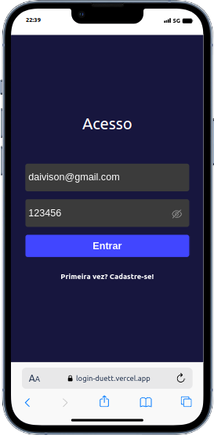
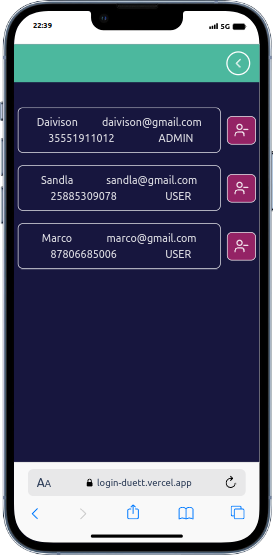
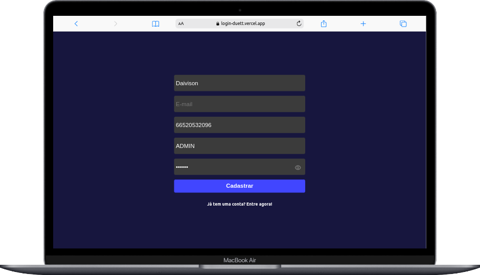
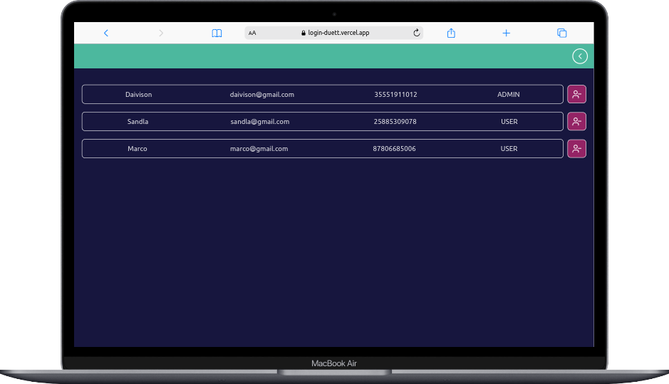

# App Login
Este app permite controlar registros de usuários no qual, apenas usuários com perfil de administrador podem acessar determinadas telas.

## Deploy
https://login-duett.vercel.app/

<br/>
<div style="style="display: flex; height: 600px; justify-content: center; gap: 20px;" >
  
  
  
  
</div>


## Back-end
https://github.com/Daivison-Morais/apiLogin-Duett

## Para rodar localmente

Clone o repositório, na raíz do projeto rode:

```bash
$ npm install
```
```bash
$ npm run build
```

```bash
$ npm run start
```

modifique a BASE_URL para localhost caso queira apontar para o back-end local: src/services/baseUrl.js

## Tecnologias utilizadas

React,
Vite,
java e
Spring boot

## Usuários prontos para login

- daivison@gmail.com 123456 -(ADMIN)
- sandla@gmail.com 123456  -(USER)
- marco@gmail.com 123456  -(USER)
